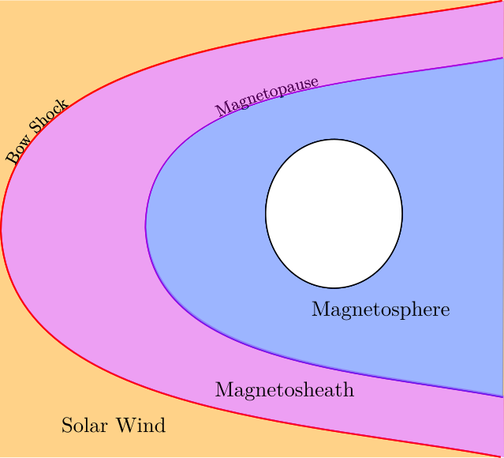

# MESSENGER at Mercury: Tracking orbits and encounters with magnetospheric boundaries

This repository details the progress on the analysis of magnetospheric boundary crossings by the MESSENGER spacecraft at Mercury from 2011 to 2015.

## Dependencies
Be sure to have all the dependencies installed

- Python
- LaTeX (for plot style)
- pyqt6 (wayland)

For non-Windows users, you may need to confirm that the LaTeX binary is part of your PATH variable.

```
export PATH=$PATH:/path/to/latex/bin
```

## Usage
To get started, clone the repository using the link

```
git clone https://github.com/odanny-oc/DIASMercuryMagnetosphere.git
```

It is recommended to create a virtual environment inside the repository to download the requirements. To do this cd into the repository and run

```
cd DIASMercuryMagnetosphere
python -m venv .venv
```
To access the Python virtual environment, run

```
source .venv/bin/activate
```

All the Python dependencies can be installed from the requirements.txt file in the code directory. To properly install the custom packages, run

```
cd code 
pip install -r requirements.txt
```

Once completed, the code, which all sits in the code directory, can be run from the terminal using

```
python /path/to/file
```

## Overview
This repository is a collection of code that produces the analysis of the Hollman et al. crossing list 2026 (https://zenodo.org/records/21392216). A detailed README can be found within each directory explaining how each file works. The analysis largely pertains to crossings and encounters of _magnetospheric boundaries_ of Mercury. There are two magnetospheric boundaries at Mercury, the _magnetopause_ (MP), and the _bow shock_ (BS). The bow shock is defined as the boundary where particles in the _solar wind_ are suddenly decelerated after first coming into contact with the magnetic field of Mercury. The magnetopause, which sits beyond the bow shock, is where the _magnetic pressure_ of the Sun's magnetic field equalises with Mercury's. This gives rise to three regions, the _solar wind_, the _magnetosheath_, and the _magnetosphere_.



A crossing, which is taken from the Hollman et al. dataset, is the moment when the spacecraft passes from one region to another. These then come with four different labels, magnetopause in (MP_IN), magnetopause out (MP_OUT), bow shock in (BS_IN), and bow shock out (BS_OUT). As the boundaries are quite variable, single crossings can be uncommon. Therefore, a useful way to characterise boundaries is using _encounters_. An encounter is a collection of crossings associated with one traversal of a boundary. The encounters code and functions use the Hollman et al. dataset to group the crossings by their encounters.

